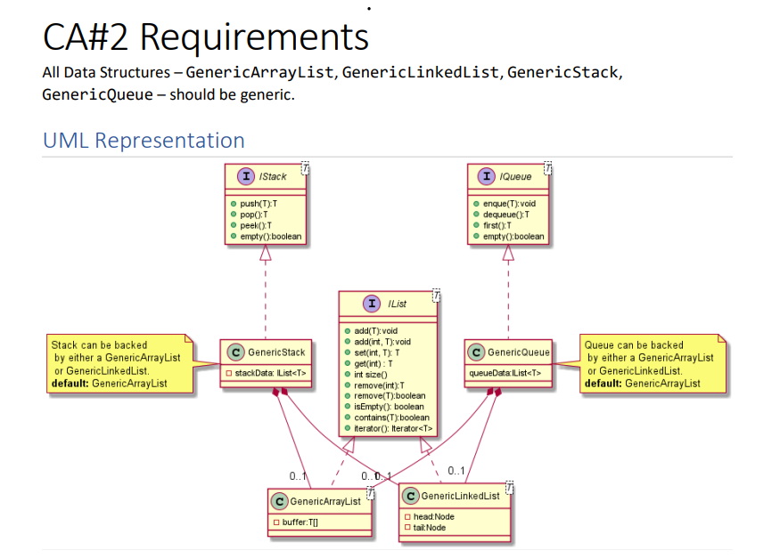
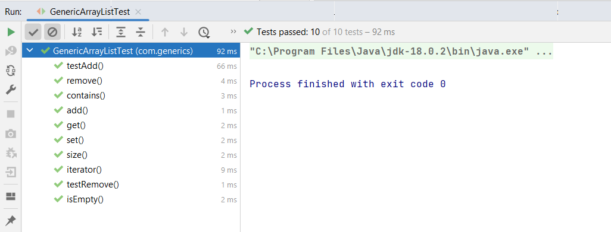
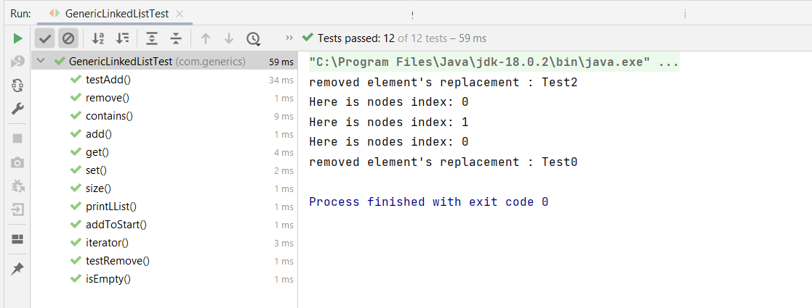
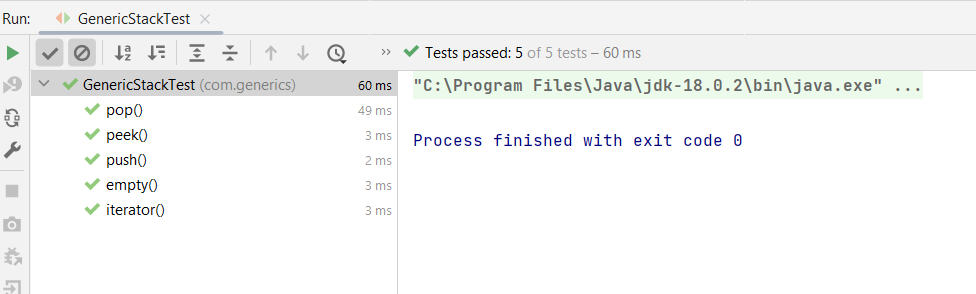
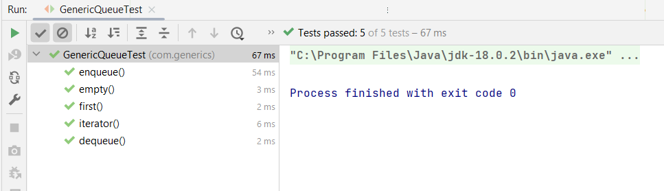
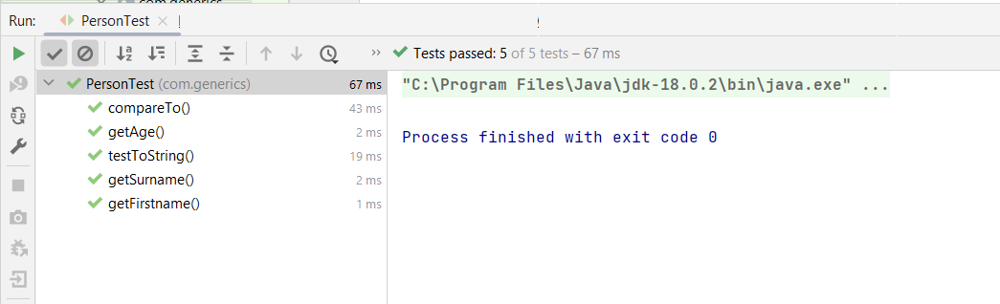

<h1 align="center">CA2 - Software Development: Data Structures & Algorithms  </h1>

<h2 align="center">Java Generics</h2>

*Student Name and Number: Neil Smyth (L00177606)*

## **Project Brief**

The objective of this project is to allow students to demonstrate the
practical knowledge  of data structures and algorithms, in particular generics, that we have
learning about in our Software Development course. 

The main language used was Java. 
Maven was also used to build this project. in tandem with JUnit,
for the testing suite and build management. The SRC folder is subdivided into main 
& test (test folder acting as associated java folder by
mirroring the contents and methods of the java folder). Please navigate to the 
following folders to find the SRC (Source Code): 
main - <code>/src/main/java/com/generics/</code> & 
test -<code>/src/test/java/com/generics/</code>.

The goal of unit testing to test individual units/blocks of code (e.g. methods) within a class.
The idea is to commit to testing early and consistently. Rerun unit tests are known as 
regression to check for potential knock on effects and mainly, we use pom.xml file (Maven) for adding dependencies.
I also heavily used my own 'SimpleGenericTester' class prior to incorporating the Junit classes,
so a lot of initial testing was done here. 

#### CA2 Requirements 

* Requirement 1: Construct GenericArrayList and GenericLinkedList classes:
The GenericArrayList and GenericLinkedList classes
should be implemented using the given IList interface 
* Requirement 2: Construct GenericStack and GenericQueue Classes:
Classes to be implemented with the given IStack and IQueue interfaces
* Requirement 3: JUnit tests for all your classes. Use Maven in tandem with Junit (5.9.0), which is 
a build management tool to help us undertake our testing giving the user structure.

Please refer to the diagram below to view the CA2 requirements visually:

#### CA2_requirements:

   


Below is a snippet of working Unit Test (Junit5) code for the Person class: 
```java
class PersonTest {

    private Person personTester; //person obj
    
    /* invoked before each test */
    @BeforeEach
    void setUp() {
        personTester = new Person(30, "Murphy", "Niall");
    }
    
    @Test
    void getFirstname() {
        assertEquals("Niall", personTester.getFirstname());
    }

    @Test
    void getSurname() {
        assertEquals("Murphy", personTester.getSurname());
    }
}

```

Here are the Junit test results over the five classes I tested:
1. GenericArrayListTestResults: 92ms


2. GenericLinkedListTestResults: 59ms


3. GenericStackTestResults: 60ms


4:GenericQueueTestResults: 67ms


5:PersonTestResult: 67ms



## Potential Improvements

I found the unit testing and test driven development overall to be an extremely robust 
and efficient way to develop programs. I completed most of the tests that were generate in IntelliJ,
however I feel that this aspect of the program could be really enhanced. Some of the unit tests are 
quite simple so I feel it would be an interested undertaking 
in improving the robustness of the test suite. I also normally use a lot of comments in my code but
on this occasion, I didn't manage to write as much test comments as I would have wished for 
a sheer lack of time. So this can be improved upon.


## Credits
ATU Donegal Software Development Course Material

### Final Points

Written by Neil Smyth(L00177606).

Thanks very much and please reach out if more information is needed.

> NOTE: This project was created for educational purposes.